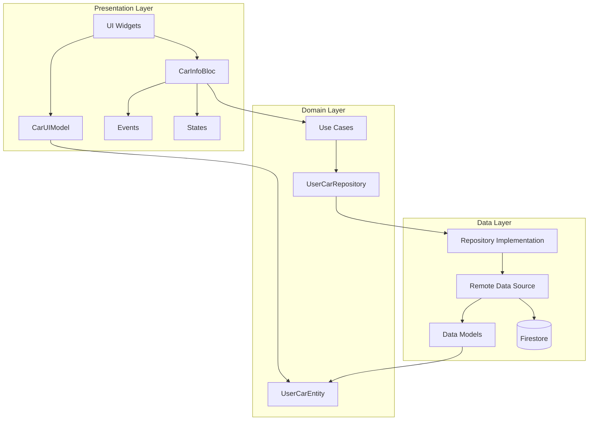
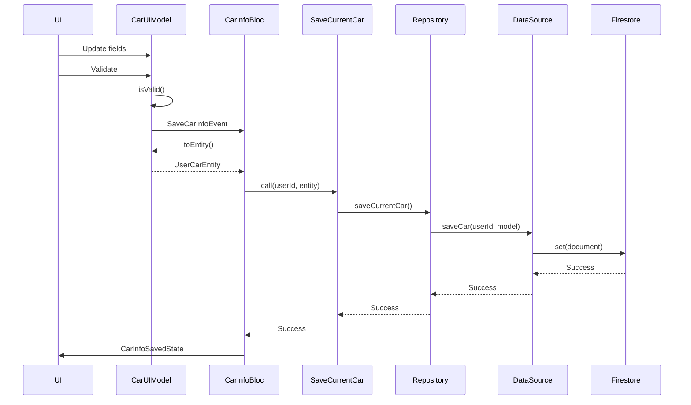
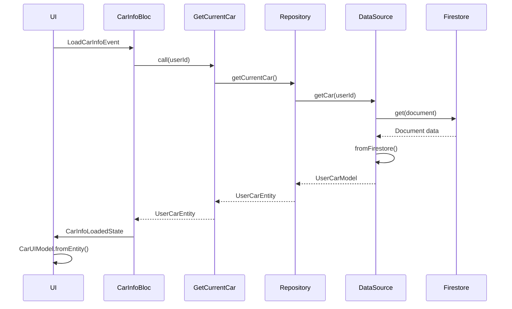

# Car Info Module - Architecture

## Layer Architecture



## Data Flow

### Saving Car Info


### Loading Car Info


## File Structure

```
carinfo/
├── data/
│   ├── datasource/
│   │   └── data_source.dart          # Firestore operations
│   └── models/
│       └── user_model.dart            # Data models with serialization
├── domain/
│   ├── entities/
│   │   └── car_entity.dart            # Domain entity
│   ├── repositories/
│   │   ├── repo_car_firebase.dart     # Repository interface
│   │   └── implem.dart                # Repository implementation
│   ├── usecases/
│   │   ├── get_current_car.dart       # Get use case
│   │   └── save_current.dart          # Save use case
│   └── [entity files]                 # Individual entity classes
└── presentation/
    ├── bloc/
    │   ├── car_info_bloc.dart         # BLoC implementation
    │   ├── car_info_event.dart        # Event definitions
    │   └── car_info_state.dart        # State definitions
    ├── models/
    │   └── car_ui_model.dart          # UI model with validation
    ├── examples/
    │   └── car_info_example.dart      # Example widget
    └── README.md                       # Documentation
```
